## Activida 4

# Introducción a Git - conceptos básicos y operaciones esenciales

```
$ git log --graph --pretty=format:'%x09 %h %ar ("%an") %s'

```

### Pregunta: ¿Cual es la salida de este comando?

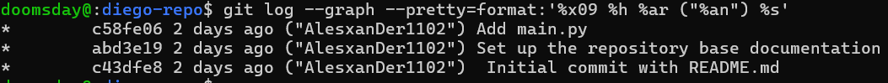

```
git log --oneline
```

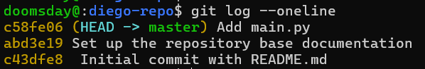

### Crear una rama desde una rama específica

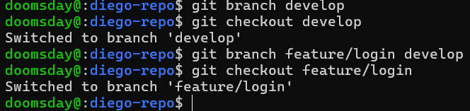

### Crear una rama desde un commit específico

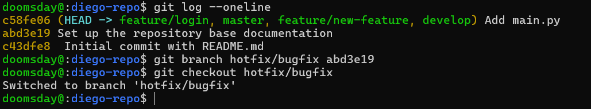

### git merge : Fusionando ramas

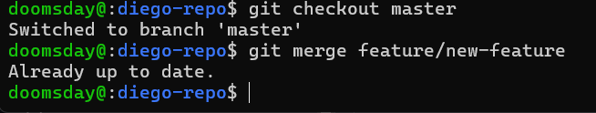

### git branch -d: Eliminando una rama

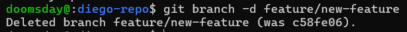

## Preguntas

¿Cómo te ha ayudado Git a mantener un historial claro y organizado de tus cambios?

Al poder ver quien realiazo los cambios y en que momento fueron nos ayuda a tener un order a la hora de organizar los cambios haciendo mas facil el tener un historial limpio y claro

¿Qué beneficios ves en el uso de ramas para desarrollar nuevas características o corregir errores?

El uso de ramas es muy util por que con ellos diferentes personas pueden ir desarrollando en diferentes ramas sin problemas de interferencias

## Ejercicios

### Ejercicio 1: Manejo avanzado de ramas y resolución de conflictos

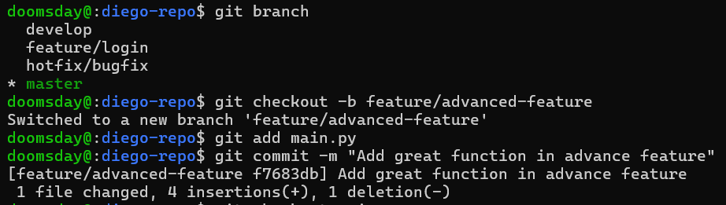

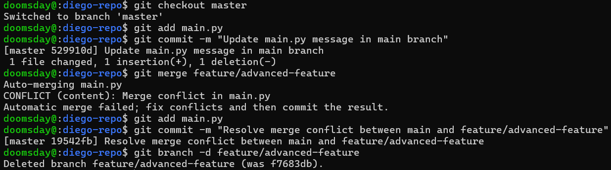

### Ejercicio 2: Exploración y manipulación del historial de commits

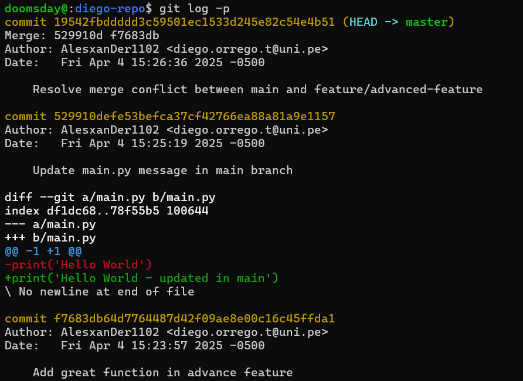

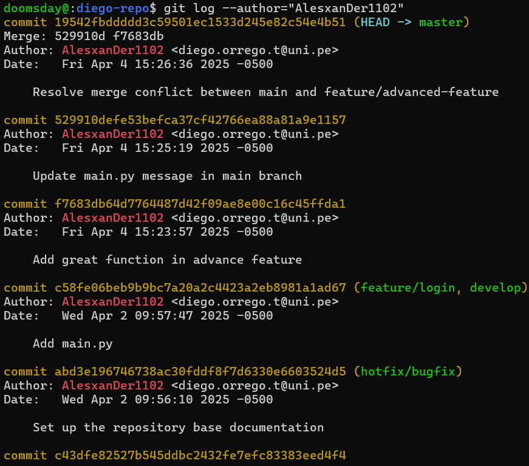

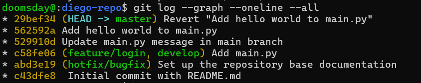

### Ejercicio 3: Creación y gestión de ramas desde commits específicos

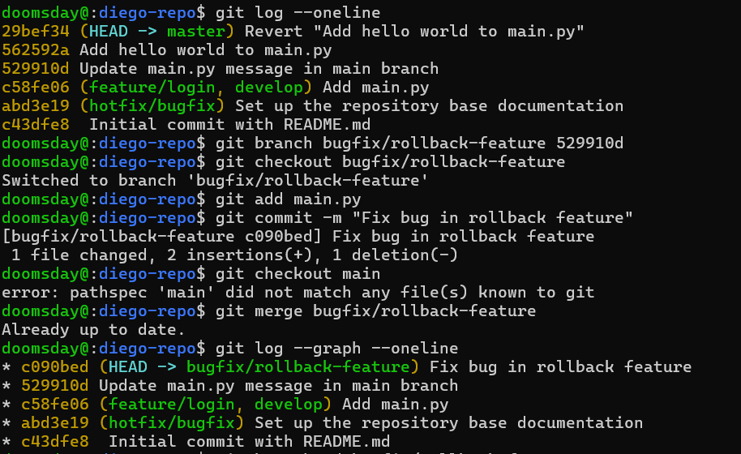

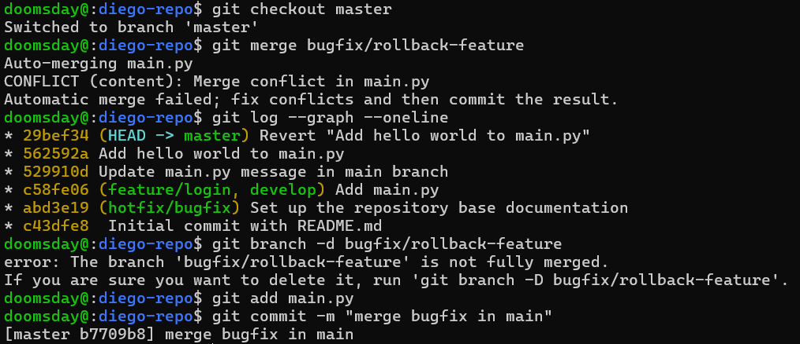

### Ejercicio 4: Manipulación y restauración de commits con git reset y git restore

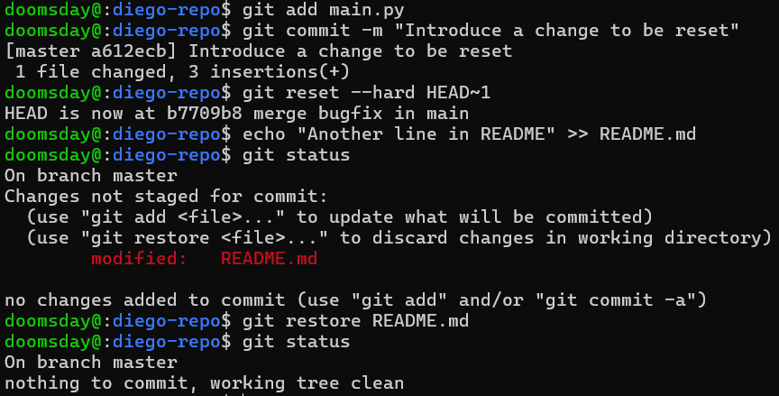

### Ejercicio 5: Trabajo colaborativo y manejo de Pull Requests

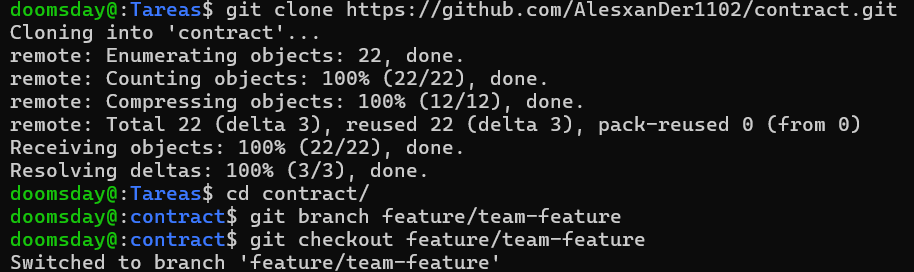

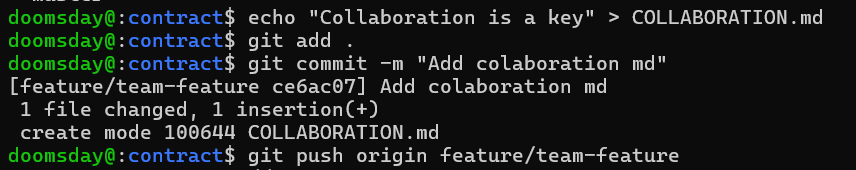

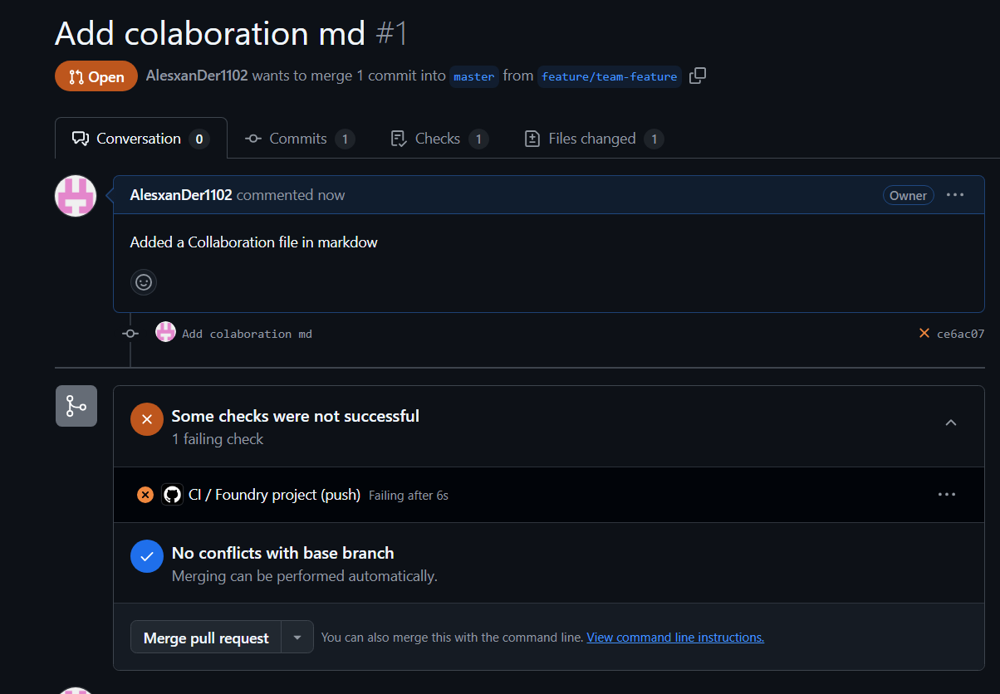

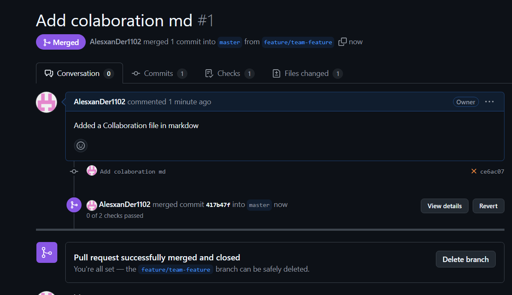

### Ejercicio 6: Cherry-Picking y Git Stash

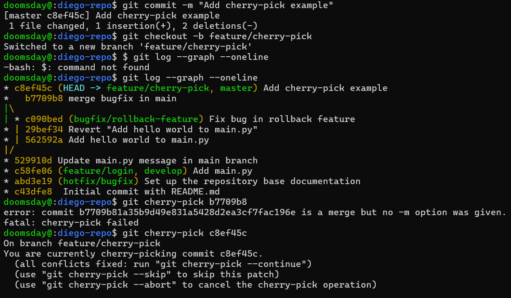

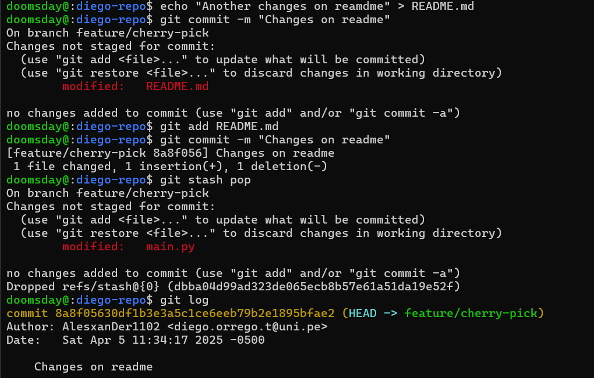