# Actividad: Explorando diferentes formas de fusionar en Git

## 1. Fusión Fast-forward (git merge --ff)

```
# Crear un nuevo repositorio
$ mkdir prueba-fast-forward-merge
$ cd prueba-fast-forward-merge
$ git init

# Agregar un archivo inicial en la rama principal (main)
$ echo "# Mi Proyecto" > README.md
$ git add README.md
$ git commit -m "Commit inicial en main"

# Crear y cambiar a una nueva rama 'add-description'
$ git checkout -b add-description

# Hacer cambios en la nueva rama y comitearlos
$ echo "Este proyecto es un ejemplo de cómo usar Git." >> README.md
$ git add README.md
$ git commit -m "Agregar descripción al README.md"

#Pregunta: Muestra la estructura de commits resultante.

# Cambiar de vuelta a la rama 'main' y realizar la fusión fast-forward
$ git checkout main
$ git merge add-description

# Ver el historial lineal
$ git log --graph --oneline
Resultado: El historial de tu repositorio.
```

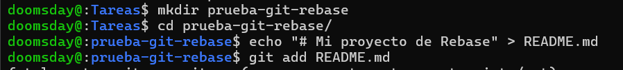

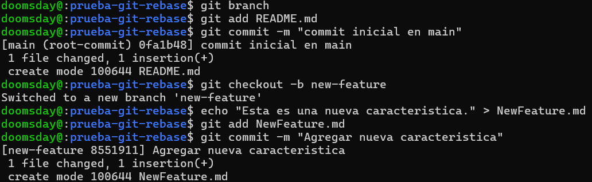

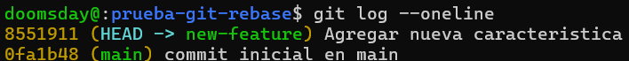

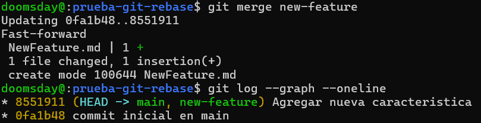

## 2. Fusión No-fast-forward (git merge --no-ff)

```
# Crear un nuevo repositorio
$ mkdir prueba-no-fast-forward-merge
$ cd prueba-no-fast-forward-merge
$ git init

# Agregar un archivo inicial en la rama principal (main)
$ echo "# Mi Proyecto" > README.md
$ git add README.md
$ git commit -m "Commit inicial en main"

# Crear y cambiar a una nueva rama 'add-feature'
$ git checkout -b add-feature

# Hacer cambios en la nueva rama y comitearlos
$ echo "Implementando una nueva característica..." >> README.md
$ git add README.md
$ git commit -m "Implementar nueva característica"

# Pregunta: Muestra el log de commits resultante.

# Cambiar de vuelta a la rama 'main' y realizar una fusión no-fast-forward
$ git checkout main
$ git merge --no-ff add-feature
Después de la edición, veamos el log ahora:

# Ver el historial
$ git log --graph --oneline

```

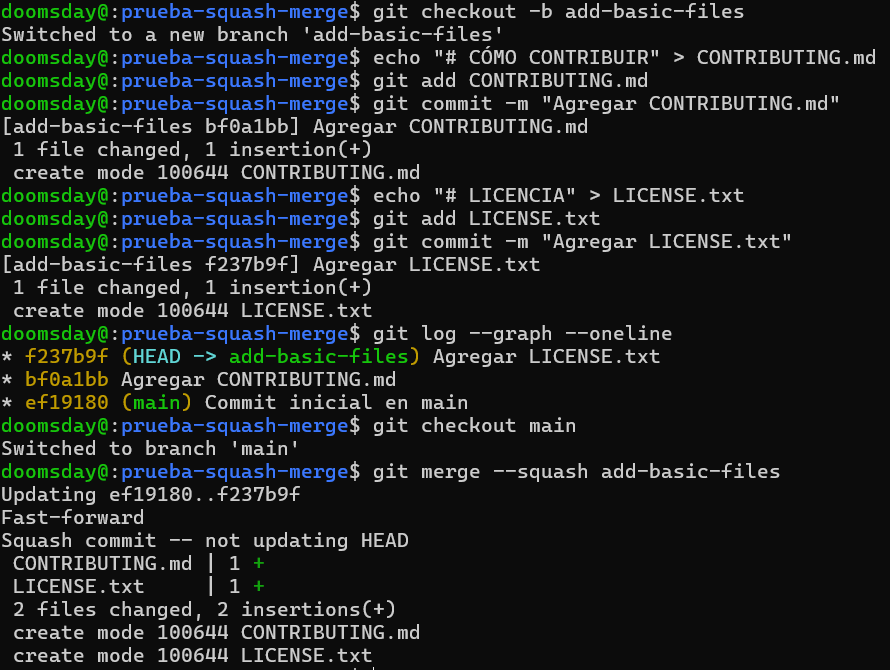

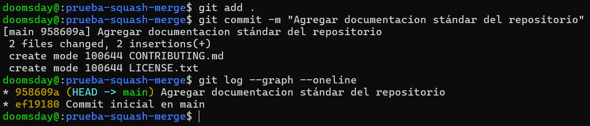

## Ejercicios

### ¿En qué situaciones recomendarías evitar el uso de git merge --ff? Reflexiona sobre las desventajas de este método.

Cuando son cambios que se realizan por uno mismo y no en un ambiente colaborativo en el que esten trabajando varias personas en paralelo por que se pierde el historia del proyecto sin saber en que comento se realizo la fusion de la rama lo que puede dificultar la comprension de como se integrarion los cambios.

### ¿Cuáles son las principales ventajas de utilizar git merge --no-ff en un proyecto en equipo? ¿Qué problemas podrían surgir al depender excesivamente de commits de fusión?

Las ventajas que tienen son que se puede tener una mejor trazabilidad y claridad sobre los cambios, al crearse un commit de fusion se preserva un historial de cuando se realizo la fusion lo cual es muy util cuando se trabaja en equipo, ademas facilita el siguimiento de caracteristicas y correcciones asi como tambien se pueden gestionar mejor los conflictos de fusion.

Los problemas que pueden surgir con los commits de fusion son que pueden hacer el historial mas complejo y dificil de leer, en proyectos pequeños o ramas que no generan cambios que se desvien puede ser innecesario usar --no-ff pues no aportaria mucho valor informativo el commit de fusion.

### ¿Cuándo es recomendable utilizar una fusión squash? ¿Qué ventajas ofrece para proyectos grandes en comparación con fusiones estándar?

Es recomendable cuando se quiere mantener un historial mas limpio cuando se realizaron varios commits que no realizaron cambios significativos o de prueba , asi como arreglos o correcciones, usando esto se puede evitar que halla muchos commits triviales, para proyectos con muchos colaboradores tambien suele ser una buena opcion a usar pues un uso excesivo de commits puede hacer que el historial sea caotico.

## Resolver conflictos en una fusión non-fast-forward

```

# Inicializa un nuevo repositorio:

mkdir prueba-merge-conflict
cd prueba-merge-conflict
git init
Crea un archivo index.html y realiza un commit en la rama main:

echo "<html><body><h1>Proyecto inicial CC3S2</h1></body></html>" > index.html
git add index.html
git commit -m "commit inicial del  index.html en main"

#Crea y cambia a una nueva rama feature-update:

git checkout -b feature-update
#Edita el archivo y realiza un commit en la rama feature-update:

echo "<p>.....</p>" >> index.html
git add index.html
git commit -m "Actualiza ..."
#Regresa a la rama main y realiza una edición en el mismo archivo:

git checkout main
echo "<footer>Contacta aquí example@example.com</footer>" >> index.html
git add index.html
git commit -m "....index.html"
#Fusiona la rama feature-update con --no-ff y observa el conflicto:

git merge --no-ff feature-update
#Git detectará un conflicto en index.html. Abre el archivo y resuelve el conflicto. Elimina las líneas de conflicto generadas por Git (<<<<<<<, =======, >>>>>>>) y crea la versión final del archivo con ambos cambios:

<html>
  <body>
    <h1>....</h1>
    <p>....</p>
    <footer>...example@example.com</footer>
  </body>
</html>
#Agrega el archivo corregido y completa la fusión:

git add index.html
git commit
#Verifica el historial para confirmar la fusión y el commit de resolución de conflicto:

git log --graph --oneline

```

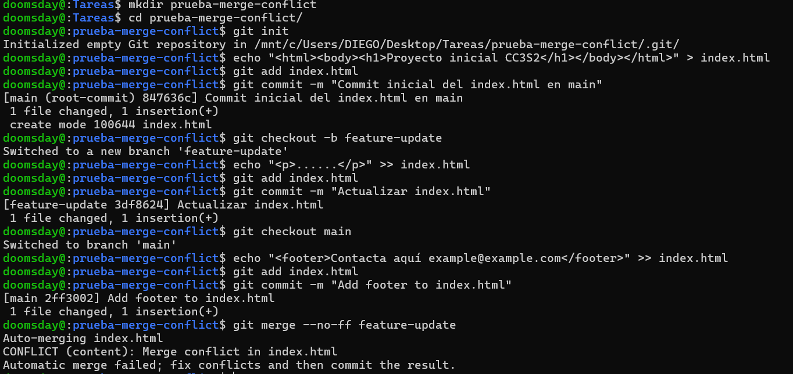

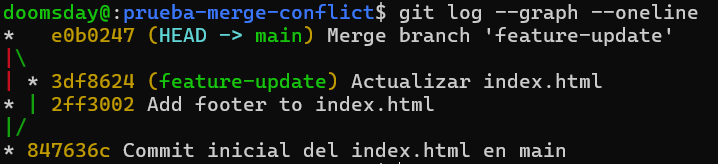

### ¿Qué pasos adicionales tuviste que tomar para resolver el conflicto?

Tube que entrar en el archivo y borrar añadir a stash el cambio y hacer un commit para ese merge

### ¿Qué estrategias podrías emplear para evitar conflictos en futuros desarrollos colaborativos?

Tratar de las mismas personas no modifique el mismo archivo al mismo tiempo sino que esten avanzando diferentes archivos

## Ejercicio: Comparar los historiales con git log después de diferentes fusiones

```

# Crea un nuevo repositorio y realiza varios commits en dos ramas:

mkdir prueba-compare-merge
cd prueba-compare-merge
git init
echo "Version 1.0" > version.txt
git add version.txt
git commit -m "...."
git checkout -b feature-1
echo "Caracteristica 1 agregada" >> version.txt
git add version.txt
git commit -m "Agregar caracteristica 1"
git checkout main
git checkout -b feature-2
echo "Caracteristica 2 agregada" >> version.txt
git add version.txt
git commit -m "Se agrega caracteristica 2"

# Fusiona feature-1 usando fast-forward:

git checkout main
git merge feature-1 --ff
# Fusiona feature-2 usando non-fast-forward:

git merge feature-2 --no-ff

# Realiza una nueva rama feature-3 con múltiples commits y fusiónala con squash:

git checkout -b feature-3
echo "Caracteristica 3 paso 1" >> version.txt
git add version.txt
git commit -m "Caracteristica 3 paso 1"
echo "Caracteristica 3 paso 2" >> version.txt
git add version.txt
git commit -m "Caracteristica 3 paso 2"
git checkout main
git merge --squash feature-3
git commit -m "Agregar caracteristica 3 en un commit"

# Compara el historial de Git:

Historial Fast-forward:
git log --graph --oneline --merges --first-parent –branches
Historial Non-fast-forward:
git log --graph --oneline –merges
Historial con Squash:
git log --graph --oneline --merges --decorate --all

```

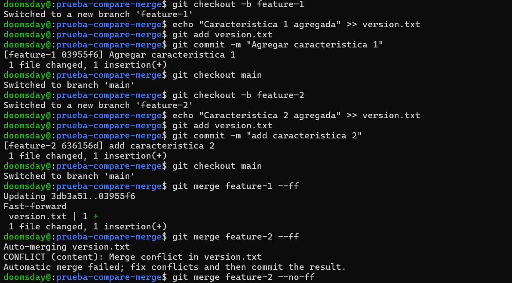

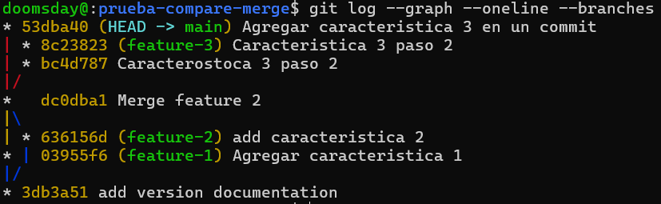

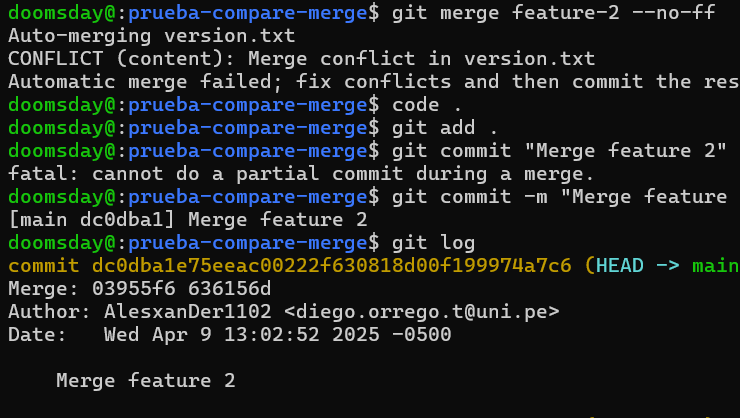

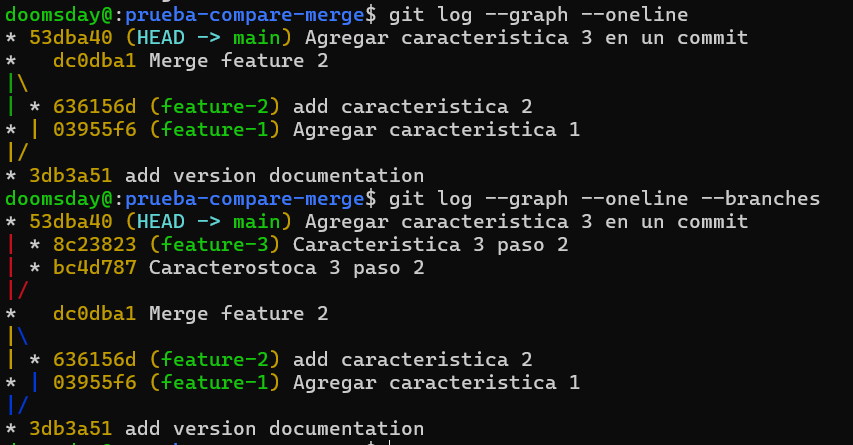

### ¿Cómo se ve el historial en cada tipo de fusión?

Tiene diferencias al momento de mostrar como se unen las ramas al mergearlo pues en un caso los commits son agregados sin un commit con el fast forward, un commit con el no fast forward y los 2 commits agrupados en un con squash en un solo commit

### ¿Qué método prefieres en diferentes escenarios y por qué?

En casos de cambios leves o poco significativos o proyectos no colaborativos prefiero el fast forward, en casos de proyectos colaborativos con varios participando en paralelo el no fast forward o squash me parece mucho mejor para llevar un historial mas claro de quien modifica y asi poder hacer correcciones mas facilmente

## Ejercicio: Usando fusiones automáticas y revertir fusiones

```
Inicializa un nuevo repositorio y realiza dos commits en main:

mkdir prueba-auto-merge
cd prueba-auto-merge
git init
echo "Linea 1" > file.txt
git add file.txt
git commit -m "Agrega linea 1"
echo "Linea 2" >> file.txt
git add file.txt
git commit -m "...linea 2"

#Crea una nueva rama auto-merge y realiza otro commit en file.txt:

git checkout -b auto-merge
echo "Linea 3" >> file.txt
git add file.txt
git commit -m "... linea 3"

#Vuelve a main y realiza cambios no conflictivos en otra parte del archivo:

git checkout main
echo "Footer: Fin del archivo" >> file.txt
git add file.txt
git commit -m "Add footer al archivo file.txt"

#Fusiona la rama auto-merge con main:

git merge auto-merge

#Git debería fusionar los cambios automáticamente sin conflictos.

#Revertir la fusión: Si decides que la fusión fue un error, puedes revertirla:

git revert -m 1 HEAD

# Verifica el historial:

git log --graph --oneline


```

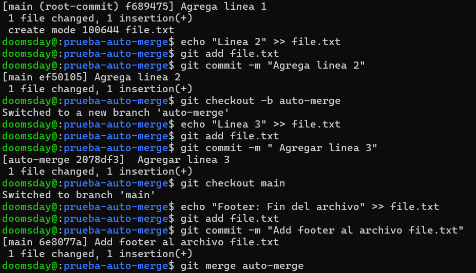

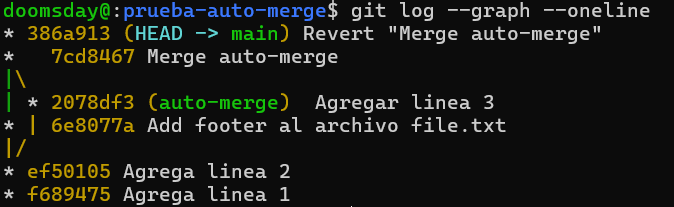

### ¿Cuándo usarías un comando como git revert para deshacer una fusión?

Lo usaria cuando realice un merge erroreno que falla o que no deberia haber hecho

### ¿Qué tan útil es la función de fusión automática en Git?

Ayuda a facilitar las fusiones de ramas pero puede producir errores

## Ejercicio: Fusión remota en un repositorio colaborativo

```
# Clona un repositorio remoto desde GitHub o crea uno nuevo:

git clone https://github.com/tu-usuario/nombre-del-repositorio.git
cd nombre-del-repositorio

#Crea una nueva rama colaboracion y haz algunos cambios:

git checkout -b colaboracion
echo "Colaboración remota" > colaboracion.txt
git add colaboracion.txt
git commit -m "...."

#Empuja los cambios a la rama remota:

git push origin colaboracion

#Simula una fusión desde la rama colaboracion en la rama main de otro colaborador. (Puedes usar la interfaz de GitHub para crear un Pull Request y realizar la fusión).

```

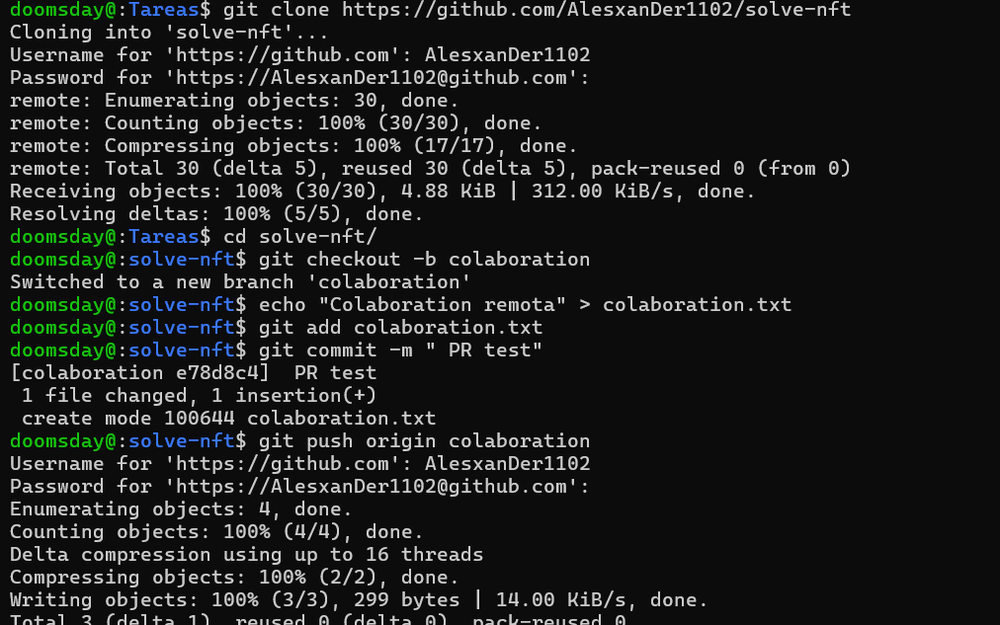

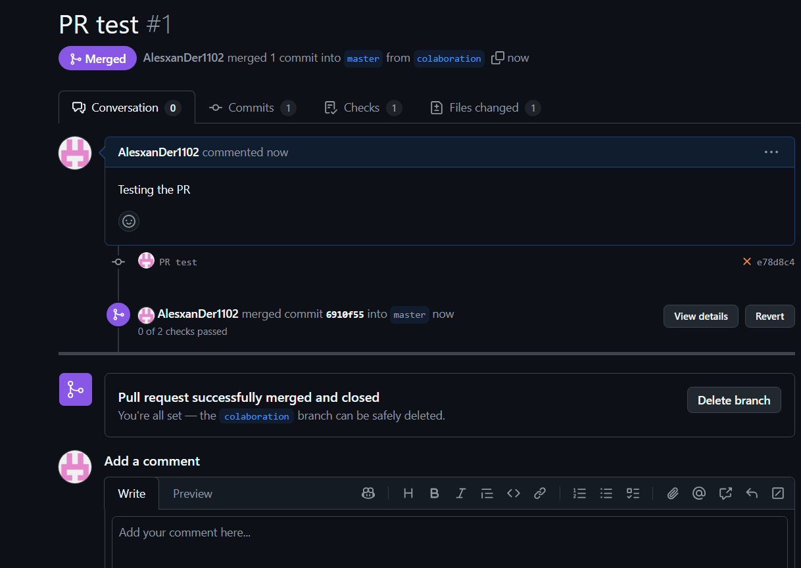
