# Actividad: Rebase, Cherry-Pick y CI/CD en un entorno ágil

## Parte 1: git rebase para mantener un historial lineal

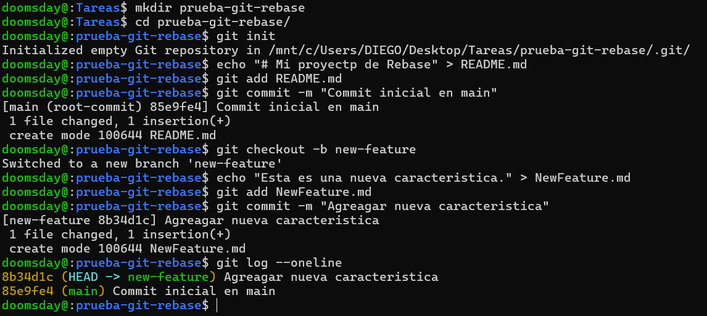

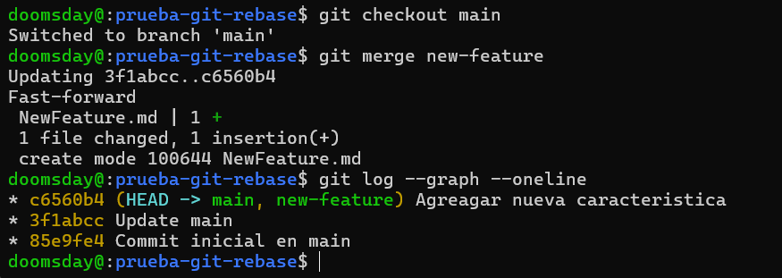

## Parte 2: git cherry-pick para la integración selectiva de commit

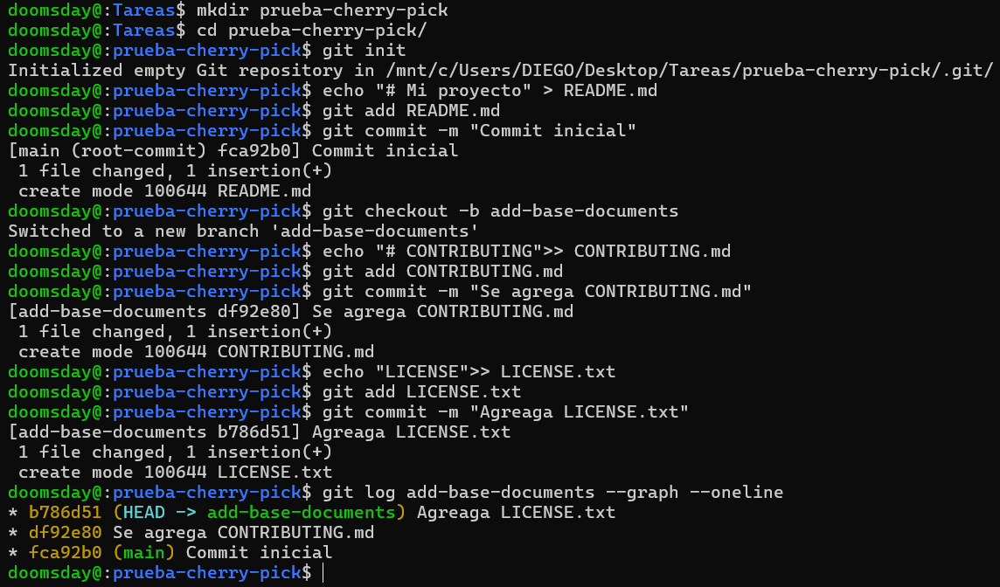

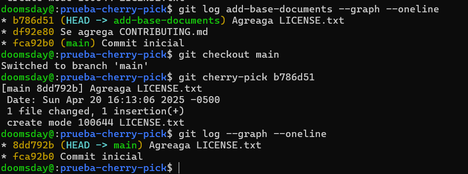

## Preguntas de discusión:

### ¿Por qué se considera que rebase es más útil para mantener un historial de proyecto lineal en comparación con merge?

Por que deja el historial de commits mas lineal sin tener el commit de merge que se pone cuando mergeas, lo cual hace que sea mas facil auditar los commits.

### ¿Qué problemas potenciales podrían surgir si haces rebase en una rama compartida con otros miembros del equipo?

Puede haber cambios los cuales perjudicarian a compañeros pues al reescribir los commits con rebase cambias los hashes, lo cual haria que el historial se complique habiendo problemas al hacer pull pues les daria conflicto ademas de que podria generar pedida de commits, por ello es mejor no hacer eso en ramas compartidas.

### ¿En qué se diferencia cherry-pick de merge, y en qué situaciones preferirías uno sobre el otro?

Cherry pick toma solamente un commit especificado de una rama y cambiando su hash lo cual es util cuando solo quieres añadir un solo cambio hecho , mientras que rebase reescribe todos los commits integrando todos los cambios hechos, preferiria cherry pick cuando quiero seleccion un cambio hecho en un solo archivo o un funcionalidad hecha en un commit, y rebase cuando quiero todos los cambios ralizados en la rama que hare rebase.

### ¿Por qué es importante evitar hacer rebase en ramas públicas?

Por que al reescribir los commits y cambiar hashes hace que se pierda la coherencia de commits para las otras personas que trabajen con esa rama generanco coflictos con los commits o perdidas de informacion.

## Ejercicios teóricos

    - Diferencias entre git merge y git rebase
        Pregunta: Explica la diferencia entre git merge y git rebase y describe en qué escenarios sería más adecuado utilizar cada uno en un equipo de desarrollo ágil que sigue las prácticas de Scrum.

        La difernecia es que con merge tu combinas dos ramas desarrollo manteniendo el historial original de commits y creando un commit de merge, mientras que con rebase aplica los commits de una de las ramas sobre la otra reescribiendo el historial de commits para que este sea lineal, para un equipo de desarrollo agil lo mejor seria usar merge para integrar ramas de desarrollo para poder reflejar los puntos de interest y poder tener una trazabilidad mas definida de los cambios.

    - Relación entre git rebase y DevOps
        Pregunta: ¿Cómo crees que el uso de git rebase ayuda a mejorar las prácticas de DevOps, especialmente en la implementación continua (CI/CD)? Discute los beneficios de mantener un historial lineal en el contexto de una entrega continua de código y la automatización de pipelines.

        Al tener un historial lineal por el rebase se puede hacer un mejor seguimiento simplificando la identificacion de errores, que ir buscando por las bifurcaciones que quedan cuando se usa merge, ademas al hacer rebase se puede resolver antes de manera local los conflictos de ese modo las etapas de CI reciben un codigo libre de conflictos asi reduciendo fallos, tambien se evita que los sistemas de CI regeneran builds para cada commit de merge, al tener los cambios hecho con rebase en la ultima version del main, el pipeline se encarga de compilar y testear unicamente los cambios nuevos.

    - Impacto del git cherry-pick en un equipo Scrum
        Pregunta: Un equipo Scrum ha finalizado un sprint, pero durante la integración final a la rama principal (main) descubren que solo algunos commits específicos de la rama de una funcionalidad deben aplicarse a producción. ¿Cómo podría ayudar git cherry-pick en este caso? Explica los beneficios y posibles complicaciones.

        Dado que con cherry pick puedes aplicar solamente los commits que quieres sin llevarte toda la rama te seria de mucha ayuda integrando solo los commits que desees agilizando la entrega sin esperar el final del sprint, las complicaciones que pueden generarte son que tu historial estara fragmentado pues perderas el seguimiento con la rama en la que estaban esos cambios ademas de posiblemente generarte conflictos que tenias en la rama en la que estaban los cambios.

# Ejercicios prácticos

## 1. Simulación de un flujo de trabajo Scrum con git rebase y git merge

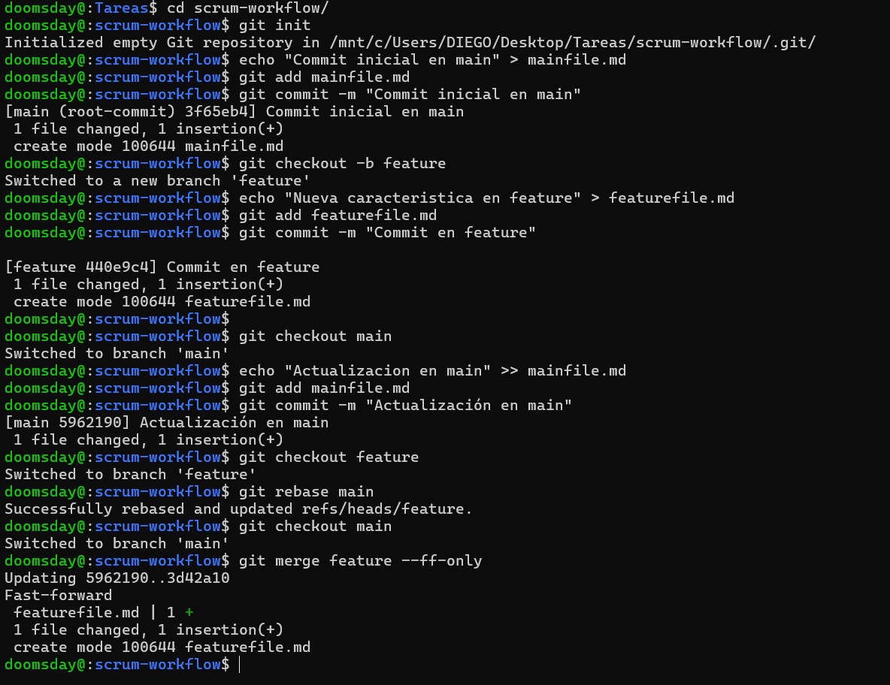

Preguntas:

¿Qué sucede con el historial de commits después del rebase?

Se cambian los hashes de los commits que se hicieron rebase

¿En qué situación aplicarías una fusión fast-forward en un proyecto ágil?

Cuando quiera tener un historial de commits lineal y limpio

## 2. Cherry-pick para integración selectiva en un pipeline CI/CD

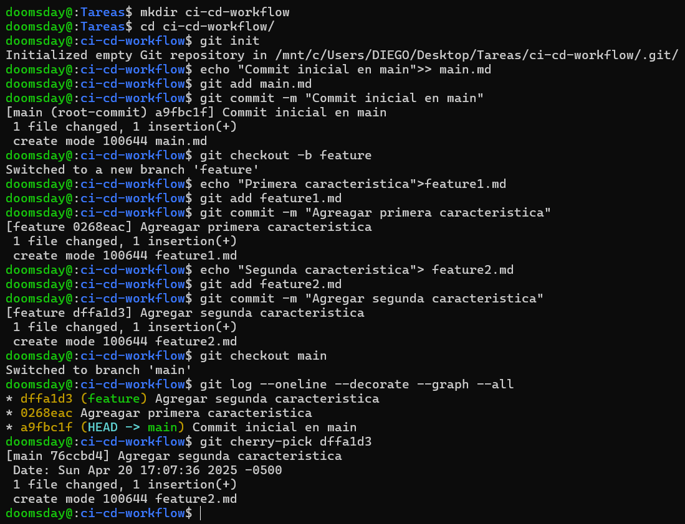

Preguntas:

¿Cómo utilizarías cherry-pick en un pipeline de CI/CD para mover solo ciertos cambios listos a producción?

Primero identificaria los commits que quiero mover o que ya esten listos para integrar cambiar a la rama de produccion y ahi hacer cherry-pick de los commits que se definieron, despues resolveria los conflictos generados por esos commits y finalmente un build testeo y despliegue .

¿Qué ventajas ofrece cherry-pick en un flujo de trabajo de DevOps?

Permite que uno pueda lanzar funcionalidades parciales que ya han sido pasado por QA y no tener que espera que la rama de desarrollo este totalmente acabada, no tienes que generar nuevas ramas o merges en main teniendo asi un historial limpio.

# Git, Scrum y Sprints

## Fase 1: Planificación del sprint (sprint planning)

### Ejercicio 1: Crear ramas de funcionalidades (feature branches)

Pregunta: ¿Por qué es importante trabajar en ramas de funcionalidades separadas durante un sprint?

Para que los cambios esten aislados, lo que ayuda tambien evitar los conflictos que se puedan generar al trabajar muchos en una misma rama, ademas de que mejora la trazabilidad, tambien mejora la integracion continua pues los pipelines pueden ejecutarse por rama.

## Fase 2: Desarrollo del sprint (sprint execution)

### Ejercicio 2: Integración continua con git rebase

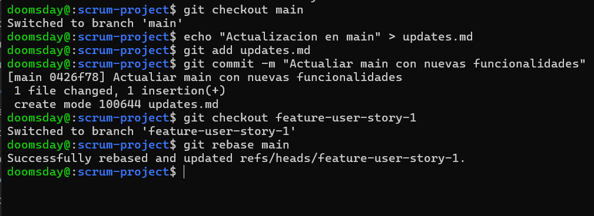

### Pregunta: ¿Qué ventajas proporciona el rebase durante el desarrollo de un sprint en términos de integración continua?

Permite evitar conflictos a futuro al hacer commit o rebase en main pues ya estas integrando los cambios que se han realizado y trabajando sobre ello

## Fase 3: Revisión del sprint (sprint review)

## Ejercicio 3: Integración selectiva con git cherry-pick

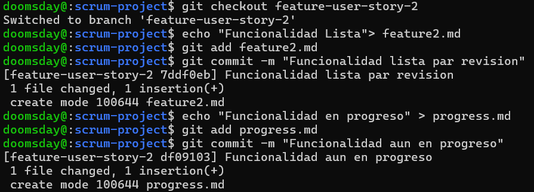

### Pregunta: ¿Cómo ayuda git cherry-pick a mostrar avances de forma selectiva en un sprint review?

Ayuda en que tu puedes traer a main solo los cambios que ya estan listos sin arrrastrar algunos que estan intermedio o en curso.

## Fase 4: Retrospectiva del sprint (sprint retrospective)

## Ejercicio 4: Revisión de conflictos y resolución

### Pregunta: ¿Cómo manejas los conflictos de fusión al final de un sprint? ¿Cómo puede el equipo mejorar la comunicación para evitar conflictos grandes?

Sincronizar varias veces antes de llegar al dia del final tanto en local con rebase de main e ir resolviendo los conflictos asi al llegar al dia limite tener pocos conflictos

## Fase 5: Fase de desarrollo, automatización de integración continua (CI) con git rebase

## Ejercicio 5: Automatización de rebase con hooks de Gitb

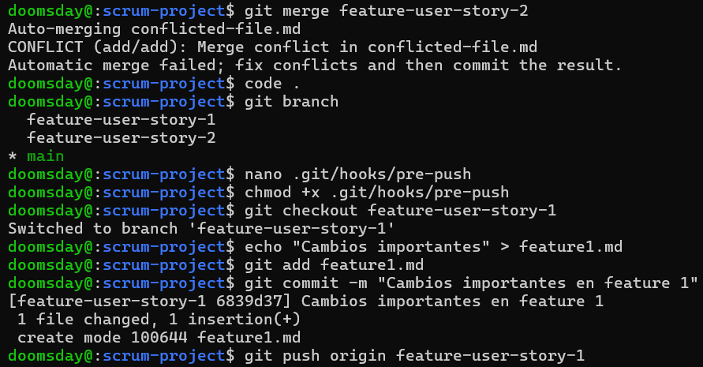

### Pregunta: ¿Qué ventajas y desventajas observas al automatizar el rebase en un entorno de CI/CD?

Automatizar el rebase en CI/CD asegura un historial lineal y la detección temprana de conflictos, pero añade complejidad al pipeline y conlleva el riesgo de sobrescribir trabajo compartido al requerir force‑push.

# Navegando conflictos y versionado en un entorno devOps

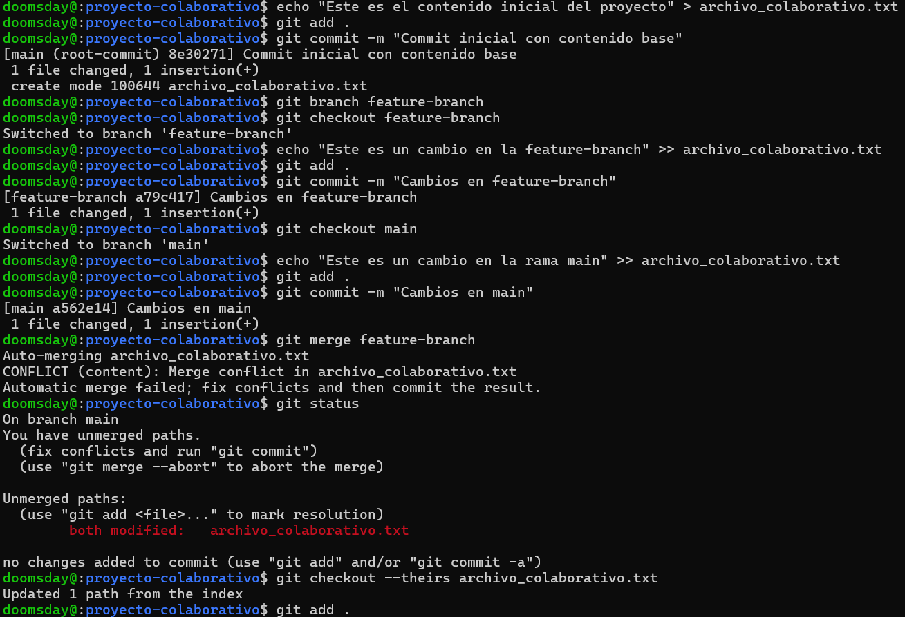

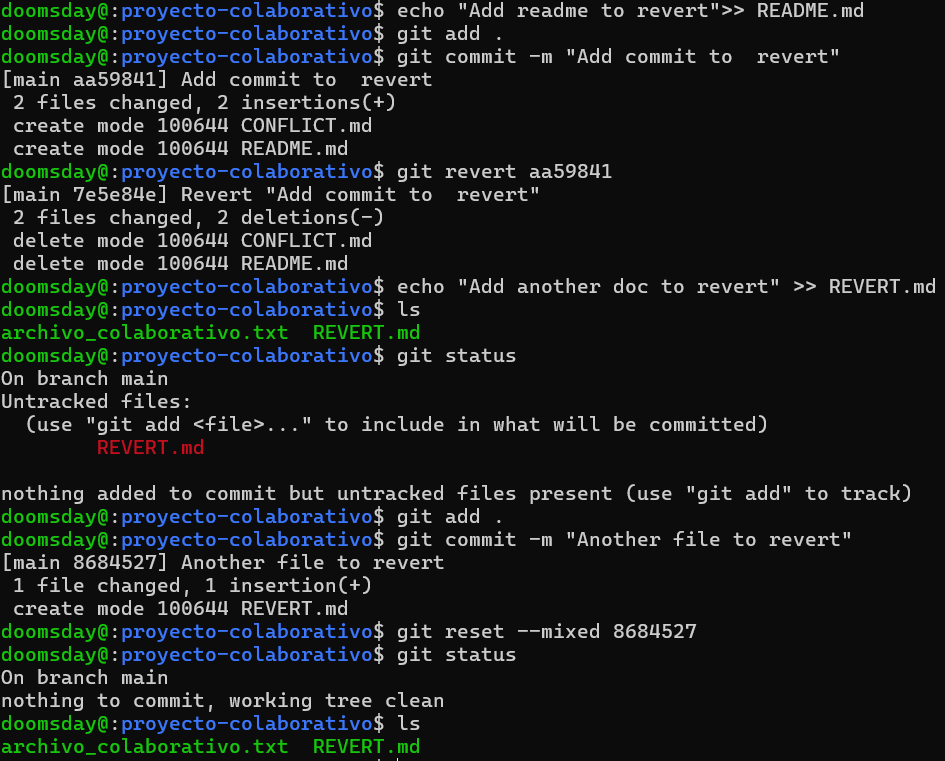

Versionado semántico y etiquetado

## Preguntas

### Ejercicio para git checkout --ours y git checkout --theirs

Contexto: En un sprint ágil, dos equipos están trabajando en diferentes ramas. Se produce un conflicto de fusión en un archivo de configuración crucial. El equipo A quiere mantener sus cambios mientras el equipo B solo quiere conservar los suyos. El proceso de entrega continua está detenido debido a este conflicto.

Pregunta:
¿Cómo utilizarías los comandos git checkout --ours y git checkout --theirs para resolver este conflicto de manera rápida y eficiente? Explica cuándo preferirías usar cada uno de estos comandos y cómo impacta en la pipeline de CI/CD. ¿Cómo te asegurarías de que la resolución elegida no comprometa la calidad del código?

Dependiendo con los cambios de que equipo quiera quedarme usaria, en este caso sea cual sea se añade y realiza el commit luego se despliegue test y linters para verificar que no tenga errores y verificamos que este en buen funcionamiento con los cambios que implementamos

### Ejercicio para git diff

Contexto: Durante una revisión de código en un entorno ágil, se observa que un pull request tiene una gran cantidad de cambios, muchos de los cuales no están relacionados con la funcionalidad principal. Estos cambios podrían generar conflictos con otras ramas en la pipeline de CI/CD.

Pregunta:
Utilizando el comando git diff, ¿cómo compararías los cambios entre ramas para identificar diferencias específicas en archivos críticos? Explica cómo podrías utilizar git diff feature-branch..main para detectar posibles conflictos antes de realizar una fusión y cómo esto contribuye a mantener la estabilidad en un entorno ágil con CI/CD.

Usaria git diff main..feature-branch para identificar las diferencias en los archivos entre la rama y main identificando asi los archivos modificados para ver los posibles conflictos que puede surgir.

### Ejercicio para git merge --no-commit --no-ff

Contexto: En un proyecto ágil con CI/CD, tu equipo quiere simular una fusión entre una rama de desarrollo y la rama principal para ver cómo se comporta el código sin comprometerlo inmediatamente en el repositorio. Esto es útil para identificar posibles problemas antes de completar la fusión.

Pregunta:
Describe cómo usarías el comando git merge --no-commit --no-ff para simular una fusión en tu rama local. ¿Qué ventajas tiene esta práctica en un flujo de trabajo ágil con CI/CD, y cómo ayuda a minimizar errores antes de hacer commits definitivos? ¿Cómo automatizarías este paso dentro de una pipeline CI/CD?

Para hacer esa simulacion sin comprometer el repositorio remoto, lo que haria es en la rama de desarrollo haria `git merge feature-branch --no-commit --no-ff ` haria corresr los test y pruebas manuales y en caso que todo pase con normalidad haria commit y push, pero si hay problemas realizo un `git merge --abort`

### Ejercicio para git mergetool

Contexto: Tu equipo de desarrollo utiliza herramientas gráficas para resolver conflictos de manera colaborativa. Algunos desarrolladores prefieren herramientas como vimdiff o Visual Studio Code. En medio de un sprint, varios archivos están en conflicto y los desarrolladores prefieren trabajar en un entorno visual para resolverlos.

Pregunta:
Explica cómo configurarías y utilizarías git mergetool en tu equipo para integrar herramientas gráficas que faciliten la resolución de conflictos. ¿Qué impacto tiene el uso de git mergetool en un entorno de trabajo ágil con CI/CD, y cómo aseguras que todos los miembros del equipo mantengan consistencia en las resoluciones?

Configuraria usando `git config --global merge.tool <nombre-herramienta> ` y a la hora de resoler los conflictos usamos `git mergetool`, esto lo que hace es que homogeniza la resolucion de conflictos en un equipo agil y acelera la reactivacion de pipeline CI/CD.

### Ejercicio para git reset

Contexto: En un proyecto ágil, un desarrollador ha hecho un commit que rompe la pipeline de CI/CD. Se debe revertir el commit, pero se necesita hacerlo de manera que se mantenga el código en el directorio de trabajo sin deshacer los cambios.

Pregunta:
Explica las diferencias entre git reset --soft, git reset --mixed y git reset --hard. ¿En qué escenarios dentro de un flujo de trabajo ágil con CI/CD utilizarías cada uno? Describe un caso en el que usarías git reset --mixed para corregir un commit sin perder los cambios no commiteados y cómo afecta esto a la pipeline.

`git reset --soft` revierte el commit pero deja los cambios en staging se puede usar para corregir mensajes de commit o combinar commits antes de hacer push, `git reset --mixed` revierte el commint pero deja los archivo en el directorio de trabajo solamente, sirve para casos en los cuales el commit rompio el pipeline, `git reset --hard ` restablece el commit, mientras que el staging y el directorio de trabajo al commit anterior borrando todo lo que no se halla commiteado

### Ejercicio para git revert

Contexto: En un entorno de CI/CD, tu equipo ha desplegado una característica a producción, pero se ha detectado un bug crítico. La rama principal debe revertirse para restaurar la estabilidad, pero no puedes modificar el historial de commits debido a las políticas del equipo.

Pregunta:
Explica cómo utilizarías git revert para deshacer los cambios sin modificar el historial de commits. ¿Cómo te aseguras de que esta acción no afecte la pipeline de CI/CD y permita una rápida recuperación del sistema? Proporciona un ejemplo detallado de cómo revertirías varios commits consecutivos.

Para esos casos lo que se puede hacer es ejecutar `git  revert commit` para generar nuevos commits en main inversos que deshacen los cambios lo cual se valida con la activacion del CI/CD para validar que la reversion halla restaurado la estabilidad manteniendo intacto el historial.

### Ejercicio para git stash

Contexto: En un entorno ágil, tu equipo está trabajando en una corrección de errores urgente mientras tienes cambios no guardados en tu directorio de trabajo que aún no están listos para ser committeados. Sin embargo, necesitas cambiar rápidamente a una rama de hotfix para trabajar en la corrección.

Pregunta:
Explica cómo utilizarías git stash para guardar temporalmente tus cambios y volver a ellos después de haber terminado el hotfix. ¿Qué impacto tiene el uso de git stash en un flujo de trabajo ágil con CI/CD cuando trabajas en múltiples tareas? ¿Cómo podrías automatizar el proceso de stashing dentro de una pipeline CI/CD?

lo que haria es guardar los cambios con `git stash push -m "SAVE"` para guardar lo que ya he hecho, cambiaria a la rama que necesita cambios, despues al terminar volveria a mi rama inicial en la que estaba trabajando y haria `git pop` para continuar con lo que estaba haciendo.

### Ejercicio para .gitignore

Contexto: Tu equipo de desarrollo ágil está trabajando en varios entornos locales con configuraciones diferentes (archivos de logs, configuraciones personales). Estos archivos no deberían ser parte del control de versiones para evitar confusiones en la pipeline de CI/CD.

Pregunta:
Diseña un archivo .gitignore que excluya archivos innecesarios en un entorno ágil de desarrollo. Explica por qué es importante mantener este archivo actualizado en un equipo colaborativo que utiliza CI/CD y cómo afecta la calidad y limpieza del código compartido en el repositorio.

Para ello crearia el archivo .gitignore donde añadiria las carpetas de .vscode/, dependencias como node_modulesm los logs \*.log y configuraciones locales como .env, tambien los resultados de los test y otros archivos temporales haciendo que solo el codigo relevante llegue al CI/CD
