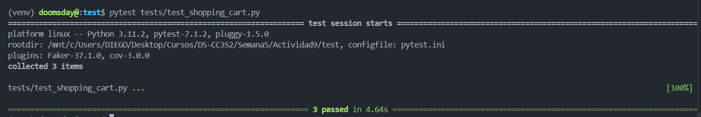
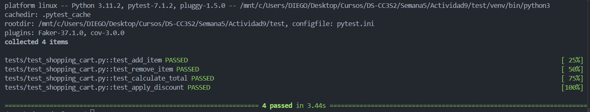
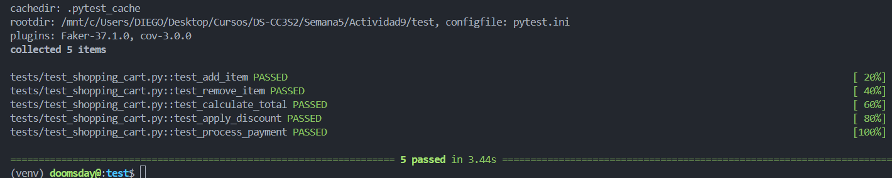
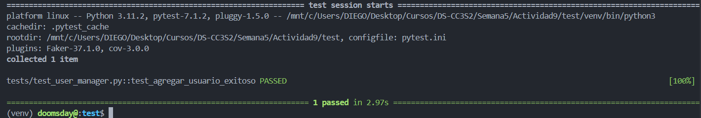
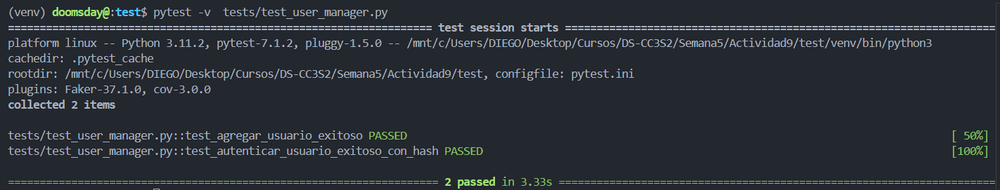

# Actividad 9

En la Primera ejecucion de prueba podemos ver que todas las pruebas pasan correctamente confirmando que la funcionalidad de shoping cart funciona correctamente luego de tres iteraciones de del porceso RGR 

Ahora contianuaremos implementando la funcionalidad de aplicar descuento con lo cual debemos añadir esa funcion y refactorizar el calcular el total

Y ejecutando las pruebas podemos ver que estas pasan satisfactoriamente despues de esas 4 iteraciones

Seguiremos con las iteraciones para añadir mas caracteristicas a shopíng cart ahora implementaremos proceso e pagos a traves de un servicio externo

Despues de ejecutar las pruebas de pytest validamos que esta nueva funcionalidad pasa el test, en esta funcionalidad lo que se hizo fue añadir una inyeccion de dependencias para manejar los pagos a traves del servicio externo

Ademas para realizar los test en este caso de la dependencia externa lo que se hizo fue usar mocks para simular esta dependencia externa y asi realizar el test

Lo que se aprendio en esta parte es que es bueno usar la inyeccion de dependencias puesto que al una clase recibir sus dependencias desde el exterior facilita el uso de mocks durante las pruebas y mejora la modularidad y flexibilidad.

Tambien es muy importante el manejo de las excepciones para capturar y propagar los errores que puedan llegar a ocurrir durante el proceso de pago y asi tener un sistema robusto y proporcionar retroalimentacion en caso de fallos.

La iteracion del RGR  se basa en el anterior, con eso nos permite poder construir una clase ShoppingCart mas robuta y funcional paso a paso. Dado que integra caracteristicas como la inyeccion de dependencias y el uso de mocks aseguramos qeu el codigo sea testeable y pueda ser mantenible con facilidad.

## Ejercicio

Desarrollar las 6 iteraciones de Desarrollo Guiado por Pruebas(TDD) RGR aplicados a UserManager

Con la Primera Iteracion Agregamos al usuario basico, y realizamos la ejecucion de pytest y la prueba pasa

Ahora en la siguiente iteracion agregamos la dependencia de hashing para encriptar y validad las contraseñas y este test pasa, y al usar la inyeccion de dependencias nos permite cambiar la logica de hashing sin modificar UserManager

Continuamos con la iteracion ahora agregando El uso de un Mock para verificar las llamadas, aseguradonos de que cada ves que se llame ad_user, se invoque el método hash denuestro sevicio de hashing. Usando un mock que espia si se ha llamado el metodo y con que parametros se llamo.

Pasando a la siguiente iteracion ahora reforzaremos un prueba para manejar usuarios repetidos usaremos stubs para aislar ciertos comportamientos. el uso de stub sera  apra forzar que user_exists devuelva True.

