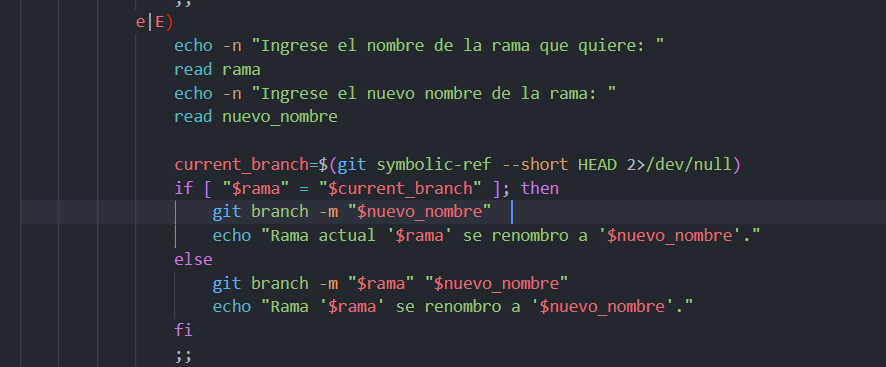
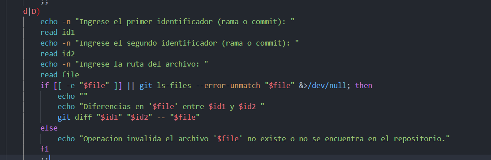
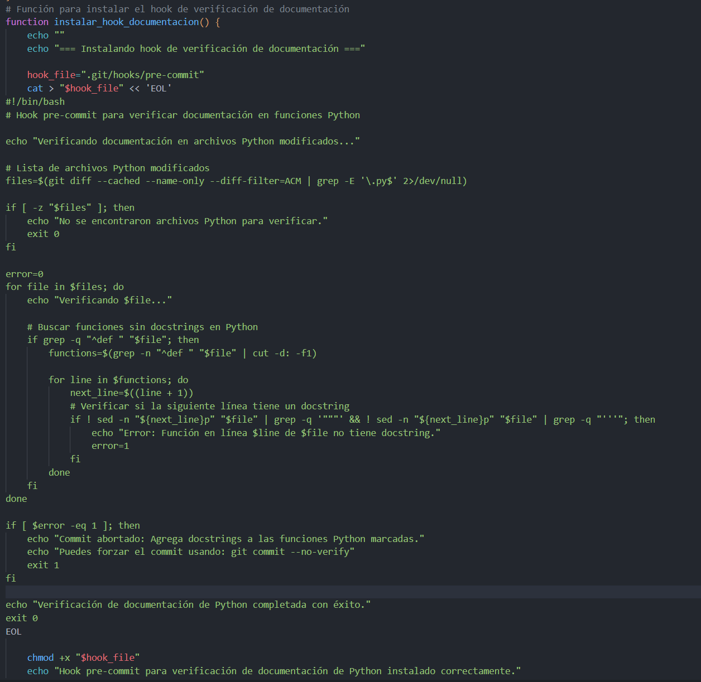
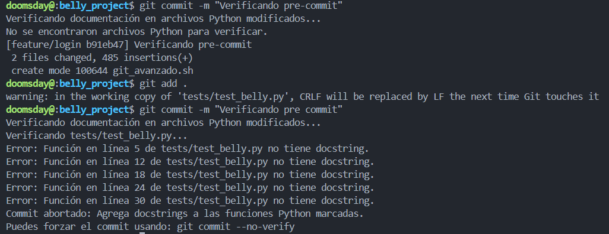
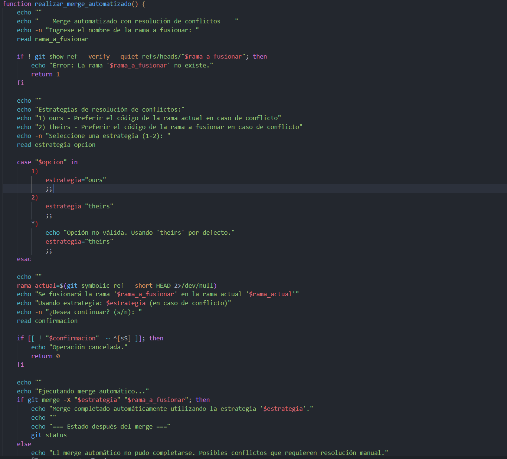
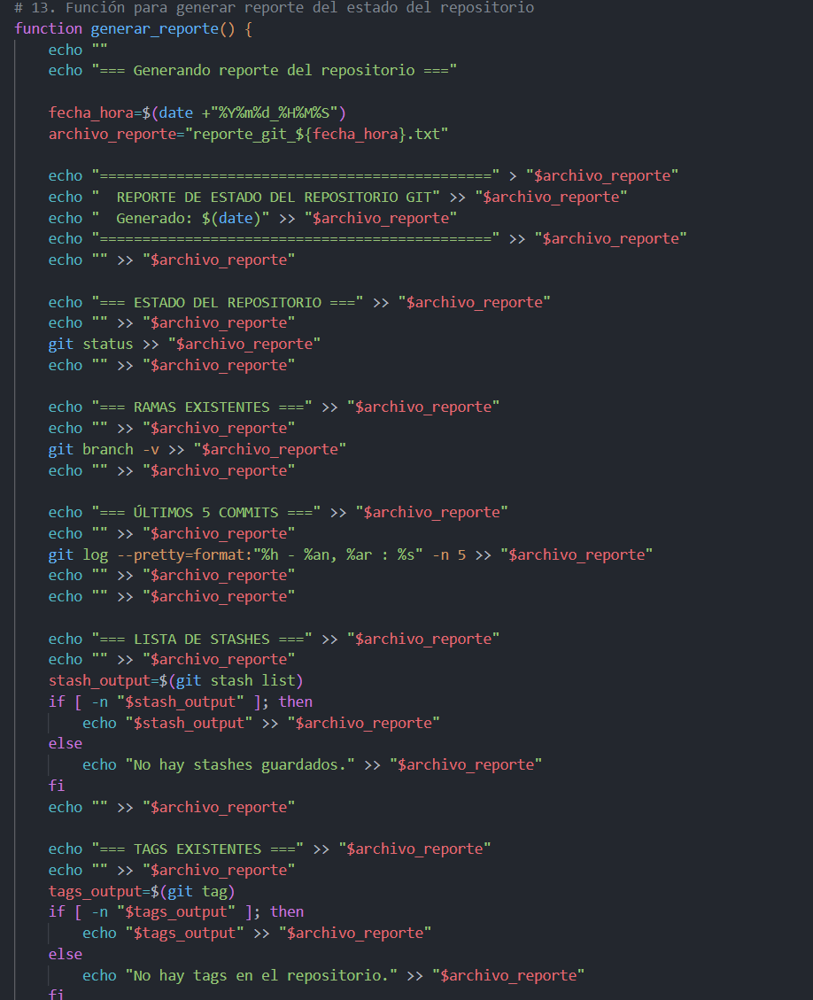
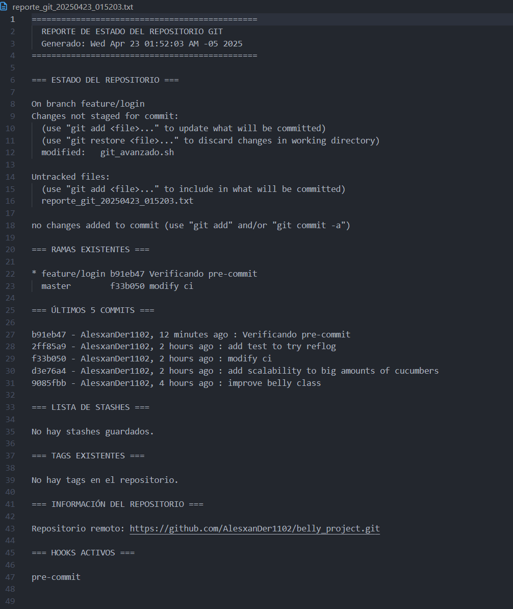

# Practica Dirigida 2

Preguntas
¿Qué diferencias observas en el historial del repositorio después de restaurar un commit mediante reflog?

Que se eliminaron los commits posteriores al commit seleccionado, dejandome en un estado en el que al commit restaurado es el HEAD de la rama

¿Cuáles son las ventajas y desventajas de utilizar submódulos en comparación con subtrees?

Utilizar submodulos tiene como ventaja que tu no tienes que tener una copia  completa de ese repositorio sino solamente referenciarlo mientra que en un subtree necesariamente tienes que tenerlo integro en tu repositorio, ademas el submodulo tiene que ser mantenido por separado, otra ventaja del submodulo es que no se tiene que mesclar con tu repositorio principal dejando asi un acabado mas limpio, ademas de que no se vuelve dependiente de tu repositorio al tener su propio git  mientras que los subtrees al volverse parte de tu repositorio se vuelve dependiente de este, lo malo es que suele tener probleas con herramientas de CI/CD mientras que los subtrees presentan mayor compatibilidad con estas.

¿Cómo impacta la creación y gestión de hooks en el flujo de trabajo y la calidad del código?

Ayuda a poder tener un codigo mas limpio por que es como poner politicas que se deben cumplir obligatoriamente y esas politicas pueden garatizar una integridad en todos los que estan trabajando, siendo de mayor utilidad para los trabajos colaborativos pues estandariza como debe hacerse por ejemplo los commits.

¿De qué manera el uso de git bisect puede acelerar la localización de un error introducido recientemente?

Ayuda a acelerar la localizacion de errores por que automatiza la busqueda binaria entre los commits que fueron seleccionados como buenos y los malos odefectuosos, haciendo asi mas facil encontrar el commit exacto que produjo el error, mientra que revisar manualmente puede llevar mucho tiempo.

¿Qué desafíos podrías enfrentar al administrar ramas y stashes en un proyecto con múltiples colaboradores?

Los desafios a enfrentarse son que es posible que oueda crearse una desincronizacion del trabajo en curso donde los stashes pueden llegar a olvidarse.

## Ejercicios
### 1 . Extiende el menú de gestión de ramas para incluir la funcionalidad de renombrar ramas.

Instrucciones:

Investiga el comando git branch -m que permite renombrar una rama.
Modifica la función de "Gestión de ramas" para agregar una nueva opción (por ejemplo, "f) Renombrar una rama").
Implementa la lógica para solicitar al usuario el nombre de la rama actual y el nuevo nombre.
Verifica que, tras el cambio, la rama se renombre correctamente.
Pista: Considera cómo se comporta el cambio si la rama en uso es la que se desea renombrar.

### 2 . Amplia la sección de "Gestión de git diff" para permitir ver las diferencias de un archivo específico entre dos commits o ramas.

Instrucciones:

Investiga cómo usar git diff con la opción -- para especificar un archivo (por ejemplo, git diff commit1 commit2 -- path/to/file).
Agrega al submenú de diff una nueva opción (por ejemplo, "e) Comparar diferencias de un archivo específico").
Solicita al usuario ingresar dos identificadores (ramas o commits) y luego la ruta del archivo.
Ejecuta el comando git diff para mostrar únicamente las diferencias para ese archivo y presenta el resultado en pantalla.

### 3 . Crea una función que permita instalar automáticamente un hook que, por ejemplo, verifique si se han agregado comentarios de documentación en cada commit.

Instrucciones:

Investiga el hook pre-commit, que se ejecuta antes de que se realice un commit.
Escribe un pequeño script en Bash que verifique si se han modificado archivos y, para cada archivo modificado, compruebe si existen comentarios de documentación. Puedes establecer una regla simple, por ejemplo, que cada función definida en un archivo debe tener un comentario anterior.
Integra la función en el submenú de "Gestión de Hooks" o crea una nueva opción en el menú principal para instalar este hook.
Prueba la funcionalidad creando o modificando un commit sin la documentación requerida y verifica que el hook evite completar el commit.

### 4 . Implementa una opción en el script que realice un merge automatizado de una rama determinada en la rama actual, incluyendo la resolución automática de conflictos (siempre que sea posible).

Instrucciones:

Investiga las opciones de git merge y cómo utilizar el parámetro --strategy-option (por ejemplo, -X theirs o -X ours) para la resolución automática de conflictos.
Añade una nueva opción en el menú principal (por ejemplo, "12) Merge automatizado de una rama").
Solicita al usuario el nombre de la rama que se desea fusionar.
Ejecuta el comando de merge con una estrategia de resolución automática, por ejemplo:
git merge -X theirs <rama_a_fusionar>
Valida la operación mostrando el estado final tras el merge.

### 5 . Implementa una opción en el script que genere un reporte con información relevante del repositorio (estado, ramas, últimos commits, stashes, etc.) y lo guarde en un archivo.

Instrucciones:

Agrega una nueva opción al menú principal (por ejemplo, "13 Generar reporte de estado del repositorio").
Crea una función que ejecute varios comandos de Git (ej. git status, git branch, git log -n 5, git stash list) y redirija la salida a un archivo, por ejemplo reporte_git.txt.
Agrega mensajes claros en el reporte que indiquen qué información corresponde a cada comando.
Verifica que el archivo se cree correctamente y que contenga la información esperada.

