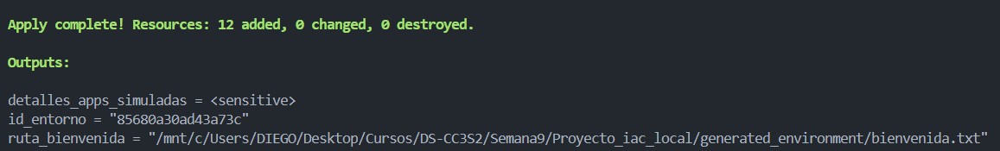
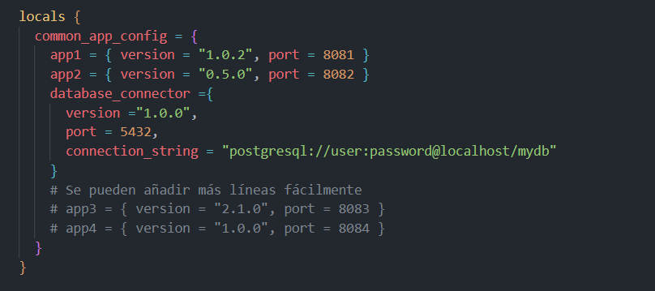
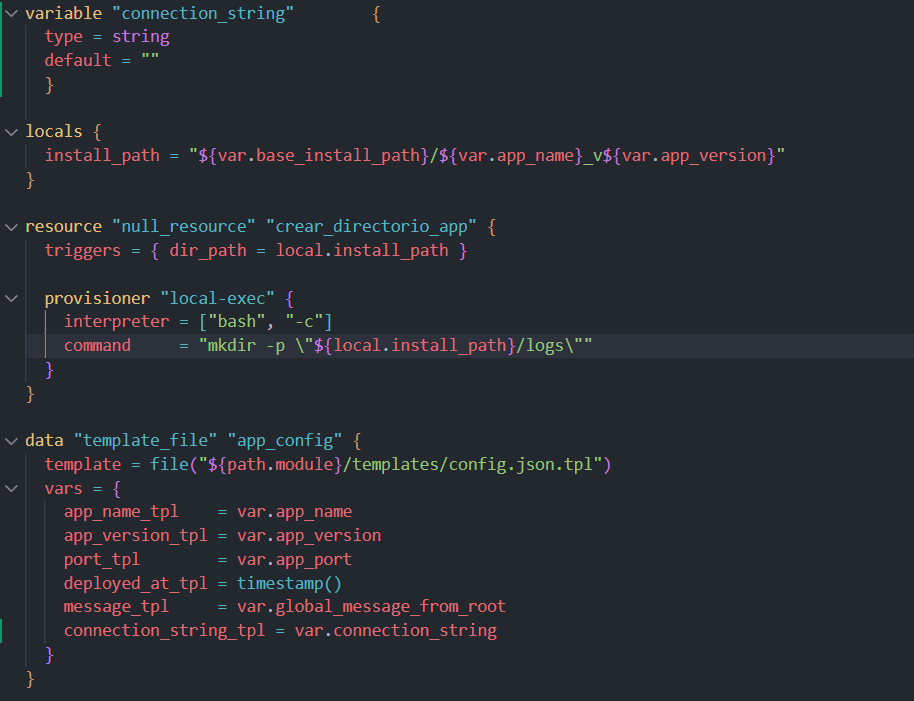
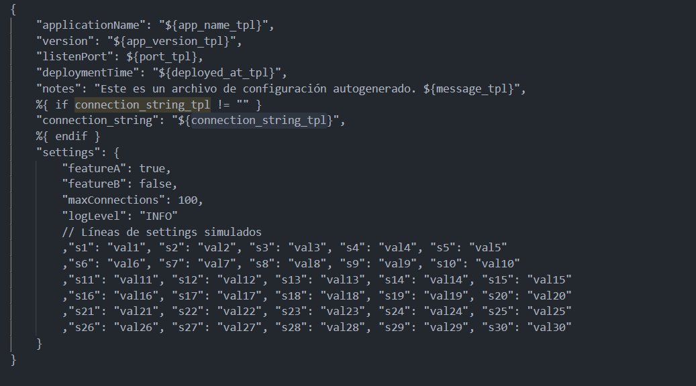
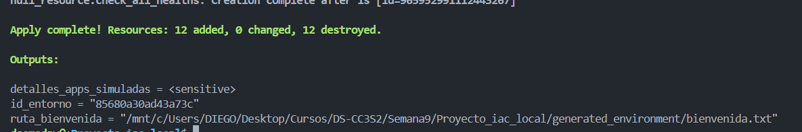

# Actividad 19

## Ejercicios
### Ejercicio de evolvabilidad y resolución de problemas:

- Tarea: Añade un nuevo "servicio" llamado database_connector al local.common_app_config en main.tf. Este servicio requiere un parámetro adicional en su configuración JSON llamado connection_string.
- Pasos:
        - Modifica main.tf para incluir database_connector.
        - Modifica el módulo application_service:
            - Añade una nueva variable connection_string_tpl (opcional, por defecto un string vacío).
            - Actualiza config.json.tpl para incluir este nuevo campo.
            - Haz que el connection_string solo se incluya si la variable no está vacía (usar condicionales en la plantilla o en locals del módulo).
        - Actualiza el script validate_config.py para que verifique la presencia y formato básico de connection_string SOLO para el servicio database_connector.
-Reto adicional: Haz que el start_simulated_service.sh cree un archivo .db_lock si el servicio es database_connector

Este ejercicio demuestra la ecolucion en IaC al añadir un servicio con requisitos especiales sin romper los ya existentes. Los cambios clave fueron usar lookup() para manejar atributos opcionales, implementar renderizado condicional en templates JSON para mantener configuraciones limpias, añadir validaciones específicas por tipo de servicio en Python que solo aplican donde son necesarias, y extender scripts bash con lógica condicional para comportamientos especiales. La solución muestra principios importantes de IaC: modularidad (el módulo acepta parámetros opcionales), flexibilidad (diferentes servicios pueden tener diferentes campos), validación inteligente (reglas específicas por tipo de servicio), y manejo robusto de casos edge (como nombres de servicios con guiones bajos). El reto adicional del archivo .db_lock simula comportamiento real de infraestructura, demostrando cómo los scripts de IaC pueden modelar operaciones complejas del mundo real.

## Ejercicio de refactorización y principios:

### Tarea: Actualmente, el generate_app_metadata.py se llama para cada servicio. Imagina que parte de los metadatos es común a todos los servicios en un "despliegue" (ej. un deployment_id global).
## Pasos:
    - Crea un nuevo script Python, generate_global_metadata.py, que genere este deployment_id (puede ser un random_uuid).
    - En el main.tf raíz, usa data "external" para llamar a este nuevo script UNA SOLA VEZ.
    - Pasa el deployment_id resultante como una variable de entrada al módulo application_service.
    - Modifica generate_app_metadata.py y/o config.json.tpl dentro del módulo application_service para que incorpore este deployment_id global.
    - Discusión: ¿Cómo mejora esto la composabilidad y reduce la redundancia? ¿Cómo afecta la idempotencia?